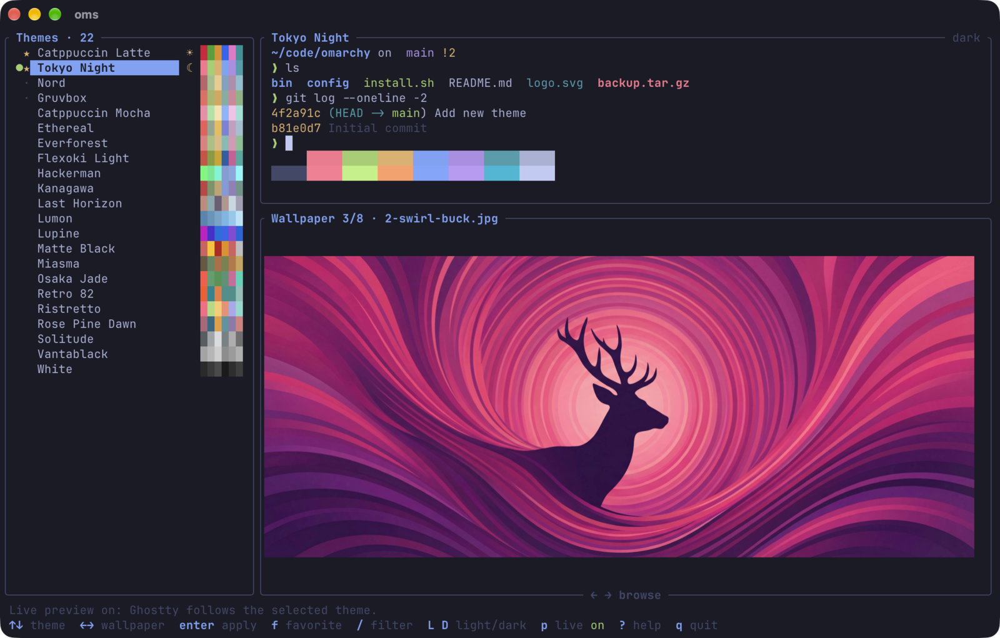
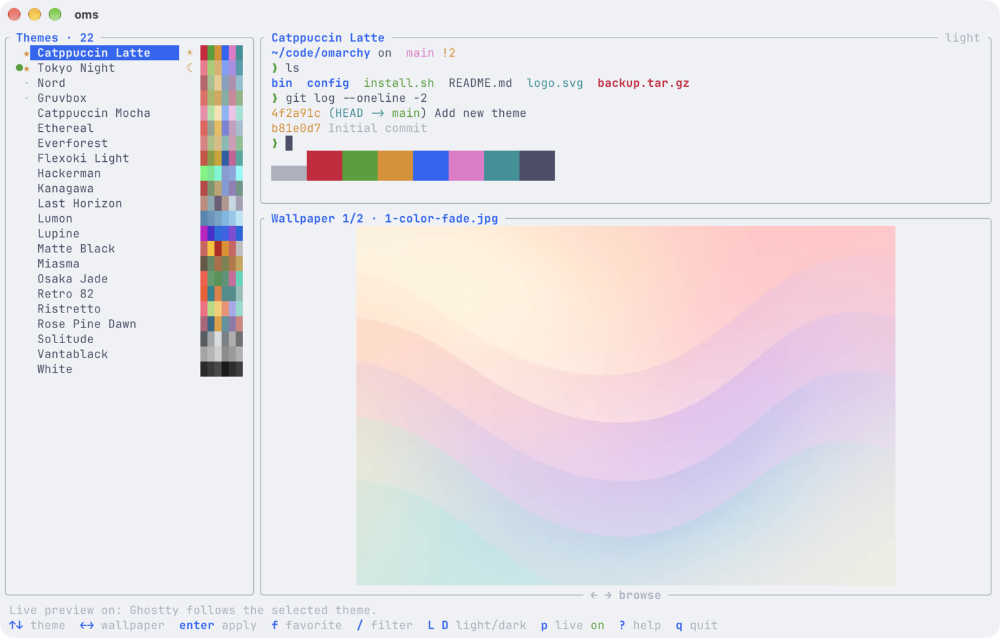

# oms

Pick an [Omarchy](https://github.com/omacom/omarchy) theme for [Ghostty](https://ghostty.org) and a matching macOS wallpaper from one terminal UI, and apply both with one key.



- **All 22 Omarchy themes**, each with a preview of its colors and its own wallpapers.
- **Live preview:** while you move through the list, Ghostty recolors to the selected theme. Quit without applying and your theme comes back.
- **Real wallpaper previews**, drawn as images right in the terminal.
- **One key applies both:** the Ghostty theme and the desktop wallpaper, on every Space and display.

macOS only. Themes come from [ghostty-omarchy-themes](https://github.com/Mr-Sunglasses/ghostty-omarchy-themes) and wallpapers from [omarchy-wallpapers](https://github.com/Mr-Sunglasses/omarchy-wallpapers).



## Install

```sh
curl -fsSL https://kanishkk.xyz/oms | bash
```

Or straight from GitHub:

```sh
curl -fsSL https://raw.githubusercontent.com/Mr-Sunglasses/oms/main/install.sh | bash
```

This puts the `oms` command in `~/.local/bin`. It's a universal binary, so it runs on Apple silicon and Intel Macs. Git must be installed (`xcode-select --install`).

With [Rust](https://rustup.rs) you can also build it yourself:

```sh
cargo install --git https://github.com/Mr-Sunglasses/oms
```

## Use

```sh
oms
```

The first run downloads the themes and wallpapers (about 100 MB) into `~/Library/Application Support/omarchy-switch` and installs the theme files into `~/.config/ghostty/themes`.

| Key | Action |
|---|---|
| <kbd>↑</kbd> <kbd>↓</kbd> or <kbd>j</kbd> <kbd>k</kbd> | Choose a theme |
| <kbd>←</kbd> <kbd>→</kbd> or <kbd>h</kbd> <kbd>l</kbd> | Choose one of its wallpapers |
| <kbd>Enter</kbd> | Apply the theme and the wallpaper |
| <kbd>t</kbd> | Apply only the theme |
| <kbd>w</kbd> | Apply only the wallpaper |
| <kbd>r</kbd> | Pick a random theme and wallpaper |
| <kbd>p</kbd> | Turn live preview on or off |
| <kbd>g</kbd> <kbd>G</kbd> | Jump to the first or last theme |
| <kbd>q</kbd> or <kbd>Esc</kbd> | Quit |

A green dot marks the theme and wallpaper that are applied now.

### From scripts

```sh
oms list                      # themes and how many wallpapers each has
oms apply tokyo-night         # theme + its first wallpaper
oms apply "Tokyo Night" 3     # theme + its 3rd wallpaper
oms apply nord random         # theme + a random wallpaper
oms update                    # download new themes and wallpapers
```

To use your own checkouts of the two repos, pass `--themes <dir>` and `--wallpapers <dir>`.

## How it works

- **Theme:** sets the `theme = Omarchy …` line in your Ghostty config and leaves the rest of the file alone. It edits the file that sets the theme now, or `~/.config/ghostty/config` if none does. It then sends Ghostty `SIGUSR2`, which makes Ghostty reload its config and recolor every window.
- **Wallpaper:** sets the wallpaper on every Space and every display, and makes it the default for new Spaces. macOS's public API only changes the current Space, so `oms` updates the wallpaper settings file directly (`~/Library/Application Support/com.apple.wallpaper/Store/Index.plist`) and restarts `WallpaperAgent` so it reloads them. This needs no extra permissions. On macOS before 14, which doesn't have that file, it changes the current Space only.
- **Preview:** wallpapers are drawn with the Kitty graphics protocol, which Ghostty supports. Other terminals fall back to colored blocks.

Notes:

- If your config uses `theme = light:…,dark:…`, applying a theme replaces it with a single theme.
- The Omarchy themes also recolor Ghostty's app icon. Icon changes need a full restart of Ghostty (quit and reopen).
- Tested with Ghostty 1.3 on macOS.

## Credits

Themes and wallpapers come from [Omarchy](https://github.com/omacom/omarchy) by David Heinemeier Hansson and its contributors, and from the original theme authors and artists. Released under the [MIT License](LICENSE).
