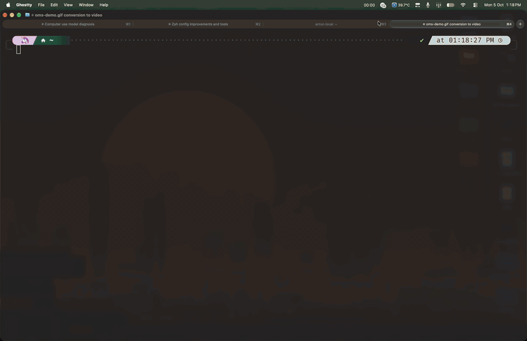

<div align="center">

# oms

Omarchy themes for your whole Mac: Ghostty, your wallpaper and your apps, switched with one key.

[](https://github.com/Mr-Sunglasses/oms/actions/workflows/ci.yml) [](https://github.com/Mr-Sunglasses/oms/releases/latest) [](https://oms.kanishkk.xyz)



<sub>▶ [Watch in full quality](https://oms.kanishkk.xyz/demo.mp4)</sub>

</div>

## Install

```sh
curl -fsSL https://kanishkk.xyz/oms | bash
```

Then run `oms`. Works on Apple silicon and Intel Macs. Update later with `oms self-update`.

## What it does

- **22 Omarchy themes** for [Ghostty](https://ghostty.org), with a live preview as you browse.
- **Matching wallpapers**, set on every desktop and screen at once.
- **Light and dark mode:** pick a day theme and a night theme, and your Mac switches between them.
- **Your apps too:** Neovim, btop, bat, tmux and the macOS accent color can follow the theme.
- **Wallpaper rotation**, favorites, search, and your own wallpapers.

## Using it

Run `oms` and pick a theme. The main keys:

| Key | Does |
|---|---|
| <kbd>↑</kbd> <kbd>↓</kbd> | Choose a theme |
| <kbd>←</kbd> <kbd>→</kbd> | Choose a wallpaper |
| <kbd>Enter</kbd> | Apply both |
| <kbd>f</kbd> | Favorite |
| <kbd>/</kbd> | Search |
| <kbd>L</kbd> / <kbd>D</kbd> | Use for light / dark mode |
| <kbd>?</kbd> | All keys |

Everything also works from the command line:

```sh
oms apply tokyo-night                 # apply a theme and its wallpaper
oms auto catppuccin-latte tokyo-night # light and dark themes
oms rotate 30m                        # new wallpaper every 30 minutes
oms apps on nvim btop bat tmux        # theme other apps too
oms wallpapers add nord ~/Pictures    # add your own wallpapers
oms status                            # see what's on
oms --help                            # everything else
```

## My Ghostty config

oms also ships the Ghostty config I use: FiraCode font, a little transparency, a smooth cursor trail and handy keybindings.

```sh
oms config install               # use all of it (your current config is backed up)
oms config install --only font   # or just part of it (see: oms config sections)
oms config restore               # go back to yours
```

## Uninstall

```sh
oms uninstall
```

## Contributing

You need [Rust](https://rustup.rs) and a Mac.

```sh
git clone https://github.com/Mr-Sunglasses/oms
cd oms
cargo run                 # run the picker
cargo test                # run the tests
```

CI checks formatting (`cargo fmt`), lints (`cargo clippy`) and tests on every pull request.

- **Code:** `src/`. The picker is in `app.rs` and `ui.rs`; theme, wallpaper and app changes are in `ghostty.rs`, `wallpaper.rs` and `apps.rs`.
- **Themes and wallpapers** come from [ghostty-omarchy-themes](https://github.com/Mr-Sunglasses/ghostty-omarchy-themes) and [omarchy-wallpapers](https://github.com/Mr-Sunglasses/omarchy-wallpapers); change them there.
- **Website:** `site/`. It deploys to [oms.kanishkk.xyz](https://oms.kanishkk.xyz) on every push to `main`.
- **Releases:** bump `version` in `Cargo.toml` and push a tag like `v0.6.0`. GitHub Actions builds and publishes it.

<details>
<summary>Signing releases</summary>

Releases are unsigned until these repository secrets exist. Once they do, builds are signed and notarized automatically:
`APPLE_CERTIFICATE` (Developer ID .p12, base64), `APPLE_CERTIFICATE_PASSWORD`, `APPLE_SIGNING_IDENTITY`, `APPLE_ID`, `APPLE_TEAM_ID`, `APPLE_APP_PASSWORD`.

</details>

Issues and pull requests are welcome.

## Credits

Themes and wallpapers come from [Omarchy](https://github.com/omacom/omarchy) and their original authors and artists. [MIT License](LICENSE).
